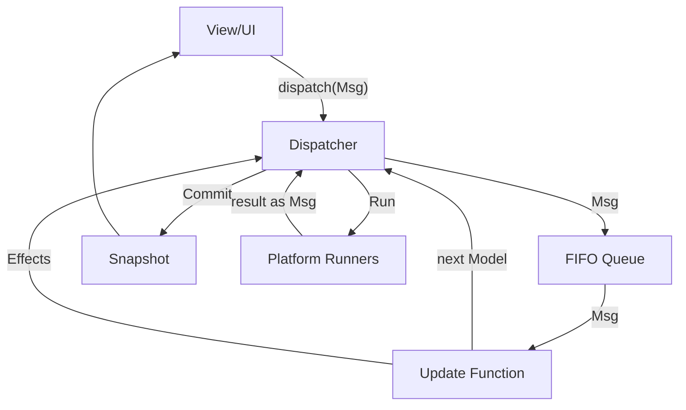

# Causaloop Architecture

Causaloop is a production-grade TypeScript monorepo template based on the **Model-View-Update (MVU)** architecture (The Elm Architecture). It is designed to be deterministic, race-condition resistant, and highly maintainable.

## Architecture Laws

1.  **Single Source of Truth**: The `Model` is the authoritative state and can ONLY be changed by the `update` function.
2.  **Pure Updates**: The `update(model, msg)` function MUST be pure. It returns a new `Model` and a list of `Effects`. It NEVER performs side effects.
3.  **Effects as Data**: All side effects (fetch, timers, etc.) are expressed as serializable `Effect` objects.
4.  **Serialized Processing**: Messages are processed one at a time via a FIFO queue in the `Dispatcher`. Re-entrancy is strictly forbidden.
5.  **Unidirectional Data Flow**: MSG -> Update -> Model -> Snapshot -> View -> MSG.
6.  **Immutable Snapshots**: The View only receives an immutable `Snapshot` of the `Model`.

## Message Flow

## Forbidden Patterns

*   **Storing Promises in Model**: Model must be JSON-serializable.
*   **Mutating Model**: Model must be treated as immutable outside `update`.
*   **Dispatching in Update**: `update` must only return effects, not dispatch messages directly.
*   **Direct Async Calls**: All async operations must go through the `Effect` system and `Runners`.
*   **Alternative State Management**: Do not use Redux, Zustand, etc. Use the core Dispatcher.

## Layer Boundaries

*   `@causaloop/core`: Platform-agnostic logic, types, and dispatcher.
*   `@causaloop/platform-*`: Platform-specific runners (Browser, VSCode, etc.).
*   `@causaloop/app-*`: Application code, features, and UI.

`core` must NEVER import from `platform` or `app`. `platform` must NEVER import from `app`.
