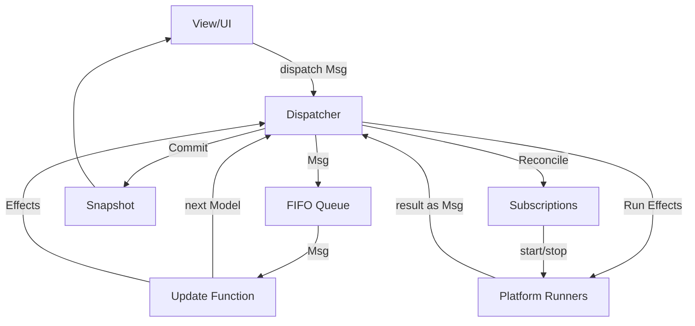

# Causaloop Architecture

Causaloop is a production-grade TypeScript monorepo based on the **Model-View-Update (MVU)** architecture (The Elm Architecture). It is designed to be deterministic, race-condition resistant, and highly maintainable.

## Architecture Laws

1.  **Single Source of Truth**: The `Model` is the authoritative state and can ONLY be changed by the `update` function.
2.  **Pure Updates**: The `update(model, msg)` function MUST be pure. It returns a new `Model` and a list of `Effects`. It NEVER performs side effects.
3.  **Effects as Data**: One-shot side effects (fetch, workers) are expressed as serializable `Effect` objects.
4.  **Subscriptions as Declarations**: Ongoing processes (timers, animation frames) are declared via `subscriptions(model)`. The runtime manages their lifecycle.
5.  **Serialized Processing**: Messages are processed one at a time via a FIFO queue in the `Dispatcher`. Re-entrancy is strictly forbidden.
6.  **Unidirectional Data Flow**: MSG -> Update -> Model -> Snapshot -> View -> MSG.
7.  **Immutable Snapshots**: The View only receives an immutable `Snapshot` of the `Model`.

## Message Flow

## Effects vs Subscriptions

Effects and subscriptions are both managed side-effect channels, but they serve different purposes:

- **Effects**: Returned by `update()`. One-shot operations (fetch a URL, compute primes). The runner executes them and dispatches result messages. They do NOT survive serialization or session restore.
- **Subscriptions**: Returned by `subscriptions(model)`. Ongoing processes (tick every second, animate every frame). The dispatcher diffs subscriptions after every update cycle and tells the runner to start or stop them. They ARE automatically resumed after session restore.

## Forbidden Patterns

- **Storing Promises in Model**: Model must be JSON-serializable.
- **Mutating Model**: Model must be treated as immutable outside `update`.
- **Dispatching in Update**: `update` must only return effects, not dispatch messages directly.
- **Direct Async Calls**: All async operations must go through the `Effect` or `Subscription` system.
- **Self-Scheduling Effects**: Ongoing processes must use Subscriptions, not recursive effect chains (prevents "phantom pending" bugs on restore).
- **Alternative State Management**: Do not use Redux, Zustand, etc. Use the core Dispatcher.

## Layer Boundaries

- `@causaloop/core`: Platform-agnostic logic, types, dispatcher, subscriptions, and replay.
- `@causaloop/platform-*`: Platform-specific runners (Browser, VSCode, etc.).
- `@causaloop/app-*`: Application code, features, and UI.

`core` must NEVER import from `platform` or `app`. `platform` must NEVER import from `app`.
