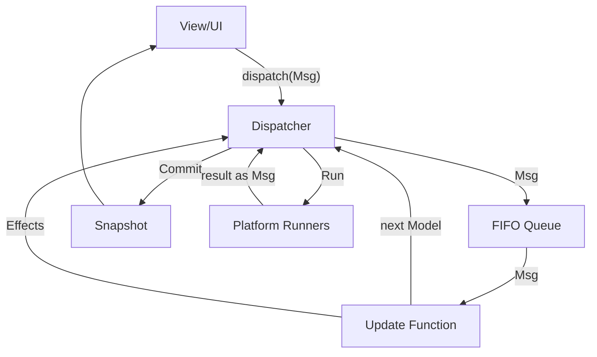

<div align="center">
  
  <h1>Causaloop</h1>
  <p><strong>A production-grade TypeScript ecosystem for deterministic, effect-safe MVU applications.</strong></p>

[](https://github.com/bitkojine/causaloop/actions/workflows/ci.yml)
[](https://github.com/bitkojine/causaloop/actions/workflows/e2e.yml)
[](https://github.com/bitkojine/causaloop/actions/workflows/stress-stability.yml)
[](https://opensource.org/licenses/MIT)

</div>

---

## 🧐 What is Causaloop?

In modern web development, managing state and side effects often leads to unpredictable "butterfly effects" in your UI. **Causaloop** provides the architectural gravity to keep your app grounded.

By strictly enforcing **The Elm Architecture (TEA)** in TypeScript, Causaloop ensures that your business logic remains pure, your side effects are manageable data, and your bugs are 100% reproducible via time-travel replay.

### The Three Laws of Causaloop

1.  📦 **Effects as Data**: Side effects (Fetch, Timer, Workers) are pure data structures until they hit the platform boundary.
2.  📼 **Deterministic Replay**: Any UI state can be reconstructed exactly from a serializable message log.
3.  🛡️ **Atomic Processing**: Messages are processed one at a time via a FIFO queue, eliminating race conditions by design.

---

## 🏗️ Architecture

Causaloop is built on a unidirectional data flow that is both predictable and scalable.



---

## 📂 Monorepo Map

Causaloop is split into three primary layers, ensuring strict separation of concerns.

| Package                                                        | Description                                                    | Status   |
| :------------------------------------------------------------- | :------------------------------------------------------------- | :------- |
| [**@causaloop/core**](./packages/core)                         | Platform-agnostic engine. Dispatcher, Replay, and VDOM types.  | `Stable` |
| [**@causaloop/platform-browser**](./packages/platform-browser) | Browser effect runners (Fetch, Workers) and Snabbdom renderer. | `Stable` |
| [**@causaloop/app-web**](./packages/app-web)                   | Demo application showcasing search, workers, and devtools.     | `Ready`  |

---

## 🧪 "Battle-Tested" Reliability

We don't just claim stability; we prove it. Causaloop is continuously benchmarked against extreme conditions:

- **⚡ High Throughput**: The Core Dispatcher handles over **1,000,000 messages/sec** in CPU-bound stress tests.
- **🕒 Timer Storms**: The Browser Runner manages **1,000+ concurrent timers** with zero starvation.
- **🐒 Monkey Testing**: Chaotic E2E simulations verify resilience against rapid-fire user interactions and navigation spam.
- **📼 Replay Torture**: Verified deterministic reconstruction of session state across **100,000+ log entries**.

---

## 🚀 Getting Started

### Prerequisites

- [Node.js](https://nodejs.org/) >= 20.0.0
- [pnpm](https://pnpm.io/) >= 10.0.0

### Quick Setup

```bash
# Install dependencies (pnpm is required)
pnpm install

# Build all packages (Required before running tests or dev)
pnpm run build

# Start the dev server
pnpm run dev
```

### Quality Suite

```bash
pnpm test          # Unit & Integration tests
pnpm test:stress   # Performance & Race condition stress tests
pnpm test:e2e      # Playwright E2E suite
pnpm lint          # ESLint boundary enforcement
```

---

## 🔭 Roadmap

- [x] **Monorepo Foundation**: pnpm workspaces + TS Project References.
- [x] **Browser Runner**: Robust Fetch, Timers, and RAF.
- [x] **Worker Pool**: Scalable background task orchestration.
- [x] **Stress Suite**: 1M+ throughput verification.
- [ ] **Context Injection**: Updates to include explicit `Time` and `Random` providers.
- [ ] **SSR Support**: Node.js effect runners for server-side rendering.
- [ ] **Worker Validation**: Add `zod` schema validation for worker messages.
- [ ] **CLI Tool**: `create-causaloop-app` scaffolder for easy setup.
- [ ] **DevTools**: Visual indicators (timeline/graph) for stalled effects.

---

## 🤝 Contributing

Contributions are welcome! Please review our [ARCHITECTURE.md](./ARCHITECTURE.md) to understand the project laws before submitting a PR.

## ⚖️ License

MIT © bitkojine
