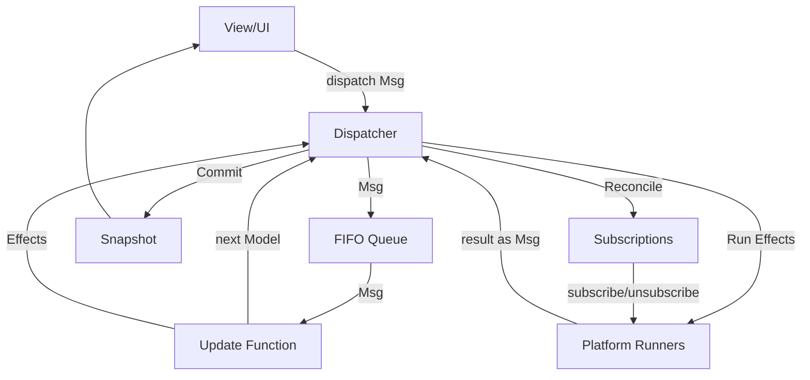

<div align="center">
  
  <h1>Causaloop</h1>
  <p><strong>A production-grade TypeScript ecosystem for deterministic, effect-safe MVU applications.</strong></p>

[](https://github.com/bitkojine/causaloop/actions/workflows/ci.yml)
[](https://github.com/bitkojine/causaloop/actions/workflows/e2e.yml)
[](https://github.com/bitkojine/causaloop/actions/workflows/stress-stability.yml)
[](https://opensource.org/licenses/MIT)

</div>

---

## 🧐 What is Causaloop?

In modern web development, managing state and side effects often leads to unpredictable "butterfly effects" in your UI. **Causaloop** provides the architectural gravity to keep your app grounded.

By strictly enforcing **The Elm Architecture (TEA)** in TypeScript, Causaloop ensures that your business logic remains pure, your side effects are manageable data, and your bugs are 100% reproducible via time-travel replay.

### The Three Laws of Causaloop

1.  📦 **Effects & Subscriptions as Data**: One-shot side effects (Fetch, Workers) are pure data structures. Ongoing processes (Timers, Animation Frames) are declarative subscriptions managed by the runtime.
2.  📼 **Deterministic Replay**: Any UI state can be reconstructed exactly from a serializable message log. Non-deterministic operations (Time, Random) are provided via a managed context and recorded for perfect playback.
3.  🛡️ **Atomic Processing**: Messages are processed one at a time via a FIFO queue, eliminating race conditions by design.

---

## 🏗️ Architecture

Causaloop is built on a unidirectional data flow with two managed side-effect channels: **Effects** for one-shot operations and **Subscriptions** for ongoing processes.



### Effects vs Subscriptions

|                | Effects                          | Subscriptions                   |
| -------------- | -------------------------------- | ------------------------------- |
| **Purpose**    | One-shot async operations        | Ongoing processes               |
| **Lifecycle**  | Fire-and-forget                  | Runtime-managed start/stop      |
| **Examples**   | Fetch, Worker compute            | Timer ticks, animation frames   |
| **Restore**    | Not restarted (state normalized) | Automatically resumed           |
| **Emitted by** | `update()` return value          | `subscriptions(model)` function |

---

## 📂 Monorepo Map

Causaloop is split into three primary layers, ensuring strict separation of concerns.

| Package                                                        | Description                                                                  | Status   |
| :------------------------------------------------------------- | :--------------------------------------------------------------------------- | :------- |
| [**@causaloop/core**](./packages/core)                         | Platform-agnostic engine. Dispatcher, Subscriptions, Replay, and VDOM types. | `Stable` |
| [**@causaloop/platform-browser**](./packages/platform-browser) | Browser runners (Fetch, Workers, Timer, RAF) and Snabbdom renderer.          | `Stable` |
| [**@causaloop/app-web**](./packages/app-web)                   | Demo application showcasing search, workers, subscriptions, and devtools.    | `Ready`  |

---

## 🧪 "Battle-Tested" Reliability

We don't just claim stability; we prove it. Causaloop is continuously benchmarked against extreme conditions:

- **⚡ High Throughput**: The Core Dispatcher handles over **1,000,000 messages/sec** in CPU-bound stress tests.
- **🕒 Timer Storms**: The Browser Runner manages **1,000+ concurrent timers** with zero starvation.
- **🐒 Monkey Testing**: Chaotic E2E simulations verify resilience against rapid-fire user interactions and navigation spam.
- **📼 Replay Torture**: Verified deterministic reconstruction of session state across **100,000+ log entries**.
- **🔄 Session Restore**: Subscriptions automatically resume after replay, eliminating stuck "phantom pending" states.

---

## 🎮 Featured Showcase: Causal Factory

**[Causal Factory](https://github.com/bitkojine/causal-factory)** is a high-performance industrial logistics simulation built to stress test Causaloop.

It demonstrates:

- **Massive Entity Scaling**: 100,000+ autonomous bots moving in a single tick.
- **Complex Logistics**: Dynamic supply/demand re-routing and state transition bursts.
- **The "Live-Link" Architecture**: A developer setup that hard-wires the game directly to the engine source for zero-build, instant-feedback development.

### Quick One-Line Setup

To clone the engine and the showcase game in the required sister-folder structure:

```bash
git clone https://github.com/bitkojine/causal-factory.git causal-factory && git clone https://github.com/bitkojine/causaloop.git causaloop-repo && cd causaloop-repo && pnpm install && cd ../causal-factory && pnpm install && pnpm run dev
```

---

## 🚀 Getting Started

### Prerequisites

- [Node.js](https://nodejs.org/) >= 20.0.0
- [pnpm](https://pnpm.io/) >= 10.0.0

### Quick Setup

```bash
pnpm install
pnpm run build
pnpm run dev
```

### Quality Suite

```bash
pnpm test          # Unit & Integration tests
pnpm test:stress   # Performance & Race condition stress tests
pnpm test:e2e      # Playwright E2E suite
pnpm lint          # ESLint boundary enforcement
```

---

## 🔭 Roadmap

- [x] **Monorepo Foundation**: pnpm workspaces + TS Project References.
- [x] **Browser Runner**: Robust Fetch, Timers, RAF, and Workers.
- [x] **Subscriptions**: Declarative lifecycle for ongoing processes (Timer, Animation, Stress).
- [x] **Session Restore**: Automatic subscription resumption + state normalization.
- [x] **Stress Suite**: 1M+ throughput verification.
- [x] **Context Injection**: Updates receive explicit `UpdateContext` for deterministic `now()` and `random()`.
- [ ] **SSR Support**: Node.js effect runners for server-side rendering.
- [ ] **Worker Validation**: Add `zod` schema validation for worker messages.
- [ ] **CLI Tool**: `create-causaloop-app` scaffolder for easy setup.

---

## 🤐 Zero Comment Policy

**This repository enforces a radical "No Comments" rule for all source code.**

The codebase is intended to be purely functional and readable without inline narratives.

### 🛡️ Enforcement

This rule is strictly enforced by both local and remote guardrails:

1.  **Local Pre-Push Hook**: A git hook runs `scripts/check-thinking-comments.sh` before you can push.
2.  **CI Pipeline**: The GitHub Actions workflow fails if any comments (`//` or `/*`) are detected in `packages/*/src`.

### 🤖 Directive for AI Agents

If you are an AI coding assistant working on this repo, follow these instructions precisely:

- **❌ Low-Value Thoughts**: "I think...", "Maybe...", "TODO:..." -> **Do NOT write these.**
- **✅ High-Value Insights**: Architectural decisions, complex invariants, or critical "gotchas". -> **Document these in [`docs/notes/ideas.md`](./docs/notes/ideas.md).**

**Do not pollute the source code with your internal monologue.**

---

## 🤝 Contributing

Contributions are welcome! Please review our [ARCHITECTURE.md](./ARCHITECTURE.md) to understand the project laws before submitting a PR.

## ⚖️ License

MIT © bitkojine
